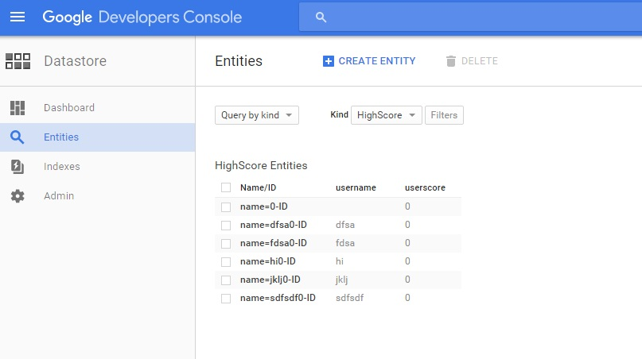
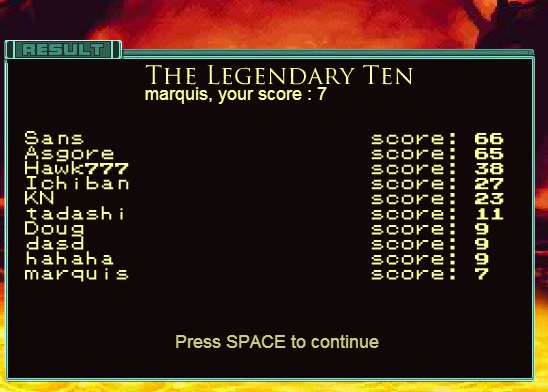

## Scoreboard - Google App Engine Python

## About:
Building a flash game in ActionScript 3.0 and storing scores using Google App Engine with Python, using HMAC-ish way. This should prevent your friends from cURLing those requests and sending a name and score of their choice.

This project contains two parts - the back end in python, and the front end, in ActionScript 3.0

* Google App Engine Files - Follow the Google App Engine guide to set up the Launcher.  https://cloud.google.com/appengine/docs/python/gettingstartedpython27/introduction

* Flash Game - Include "TopScore.as" into your game, ensure that the package declaration on line 1 reflects your folder structure

## Steps:
https://appengine.google.com/

https://console.developers.google.com/
* Set up a new project here
* Download Google App Engine Launcher - you can test locally and deploy remotely
* You can check out your Entities in Google Developers Console by going to Hamburger > Datastore > Entities 

* Remember to "Create Entity" according to what information you may want to store
* How you want to style the scores depends on your client side - in my case, the flash game:

## Resources:
Thanks to these couple of resources:

* GAE basics: http://juliobortolon.blogspot.ca/2012/02/how-to-make-high-scores-board-to-your.html
* [Chris](https://github.com/Hawk777) for an intro to MD5 and HMAC!